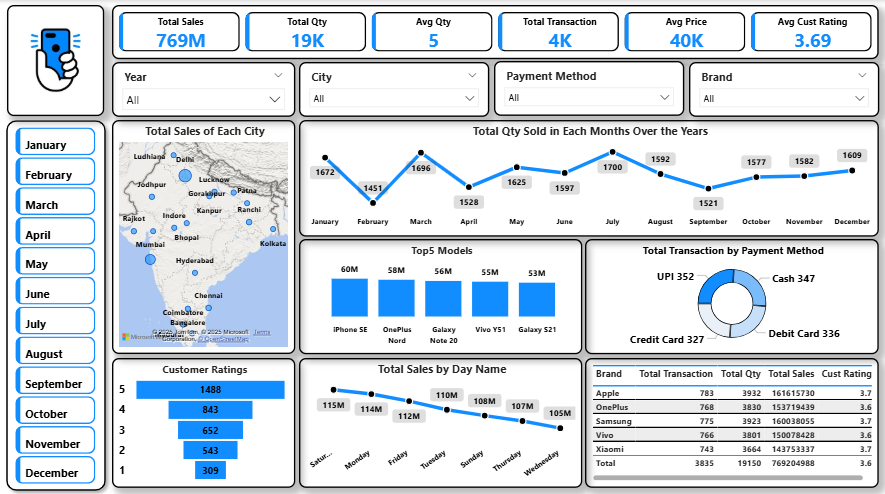

# 📊Mobile Sales Dashboard – Power BI

This project is an interactive Power BI dashboard that analyzes mobile sales performance across different cities, brands, and payment methods. The goal was to uncover sales trends, customer behavior, and brand performance from transactional and customer rating data.  

---

## 📸 Dashboard Preview
  

---

## 🚀 Dashboard Highlights
- **Total Sales:** 769M  
- **Total Quantity Sold:** 19K units  
- **Total Transactions:** 4K  
- **Average Price per Unit:** 40K  
- **Average Quantity per Transaction:** 5  
- **Average Customer Rating:** 3.69 ⭐  

---

## 🔑 Extracted Insights

### 1. Geographical Sales Performance
- Major hotspots: **Mumbai, Kolkata, Hyderabad, Bangalore, Lucknow**.  
- Strong sales presence in **South & West India**, especially **Bangalore & Hyderabad**, showing higher customer engagement.  

### 2. Monthly Sales Trends
- **Peak Months:** March (1696 units) & July (1700 units).  
- **Low Months:** April (1528 units) & September (1521 units).  
- End of year (Nov–Dec) shows consistent demand above 1500 units.  

### 3. Top-Performing Models
- **iPhone SE** leads with **60M sales**.  
- Close competition among **OnePlus Nord (58M)**, **Galaxy Note 20 (56M)**, **Vivo Y51 (55M)**, and **Galaxy S21 (53M)**.  

### 4. Customer Ratings
- Most customers rated **5 stars (1488 ratings)**, but there’s a noticeable drop-off in lower ratings.  
- Average rating of **3.69** indicates a decent experience but leaves scope for improvement in customer satisfaction.  

### 5. Sales by Day of the Week
- **Sunday (115M)** and **Monday (114M)** see the highest sales.  
- Midweek days like **Thursday (108M)** and **Wednesday (105M)** show weaker demand.  
- Weekends drive stronger customer purchase behavior.  

### 6. Payment Preferences
- **UPI (352 transactions)** slightly ahead of **Cash (347)**, **Credit Card (327)**, and **Debit Card (336)**.  
- Digital payments are gradually dominating over traditional methods.  

### 7. Brand Performance
| Brand    | Transactions | Total Qty | Total Sales | Avg Rating |
|----------|--------------|-----------|-------------|------------|
| Apple    | 783          | 3932      | 161,617,530 | ⭐ 3.7 |
| OnePlus  | 768          | 3830      | 157,194,935 | ⭐ 3.8 |
| Samsung  | 775          | 3933      | 160,004,885 | ⭐ 3.6 |
| Xiaomi   | 743          | 3664      | 154,377,333 | ⭐ 3.7 |
| Vivo     | 816          | 3795      | 135,304,345 | ⭐ 3.6 |

- **Apple leads in overall sales (161M)**.  
- **OnePlus shows the best customer satisfaction (3.8 stars)**.  
- **Samsung and Vivo** have strong unit sales but slightly lower ratings.  

---

## 📝 Conclusion
This dashboard highlights not only which brands and models are dominating the market but also how customer behavior changes across cities, months, and even days of the week.  

- **Apple is the revenue leader,** but **OnePlus is building loyalty with better ratings.**  
- **Festive/Q2 months (March, July, December)** are crucial for boosting sales.  
- **Digital payments are now the preferred choice** for customers.  

This analysis can guide strategic decisions in pricing, inventory planning, marketing campaigns, and customer experience improvements.  

---

✅ *Created using Power BI*  
✅ *Dataset: Mobile Sales Data*  
✅ *Author: Mohammed Adil Ansari*  
